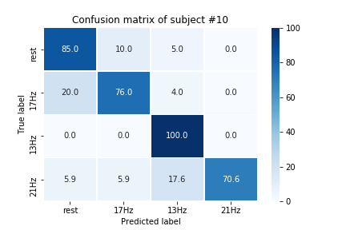

Online SSVEP in Riemanian manifold
==================================

Installation
============
You have the choice between virtual env or conda env:

- conda env
   ```
      conda env create -f  environment.yml
      conda activate ssvep-env
   ```

- virtual env
   ```
      python3 -m venv venv
      source venv/bin/activate
      pip install -r requirements.txt
    ```
Usage
======
- Script to get HDF5  (todo: parse args to allow user to choose params)
    ```
      python make_hdf5.py
    ```   
    - this should download data from MOABB and convert them in HDF5
   timeflux-replayable data that will be stored in folder ./data
    - By default, `train_runs=('run_0',)`, ie. the first run will be considered as 
    calibration data and the rest as test data. You can change those if you wish. 
    
- Notebooks

   ```
     jupyter notebook
   ```
  
     - "Online-Offline.ipynb" illustrate the sklearn pipeline offline
     - "Timeflux prediction.ipynb" loads the csv output file from Timeflux with 
     events and predictions and plot a confusion matrix 
     

- Timeflux
    ```
      timeflux -d graphs/main.yaml
    ```  
    
    - This will replay data from one subject 'in real time' (by default, subject 12)
      /!\ takes between 9 and 18 minutes to run - as long as the experiment /!\
    - If you want to try an choose the subject to replay, set variable FILE in your 
      environment, or launch the command with -e FILE={subject-number-between-1-and-12}.  
      For example, to replay data from subject #1, run : 
      
    ```
      timeflux -e FILE=1 -d graphs/main.yaml
    ``` 
    
    - This should display events and predictions in the console.
    - The output events will be dumped in a csv with name set line 14 of file
    `graphs/dump.yaml` :  `predictions_{FILE}.csv`.
    
    -  Output looks like :

    
    | label           | data                     |timestamp                        |
    |-----------------|--------------------------|-------------------------------- |
    |train_starts     | {}                       | 2020-01-01 00:01:08.703125      |
    |flickering_starts | {'target': '13Hz'}       | 2020-01-01 00:01:08.707031250   |
    |flickering_starts | {'target': '13Hz'}       | 2020-01-01 00:01:17.707031250   |
    |flickering_starts | {'target': '17Hz'}       | 2020-01-01 00:01:53.707031250   |
    |flickering_starts | {'target': '21Hz'}       | 2020-01-01 00:02:02.707031250   |
    |...              |  ...                     |  ...                            |
    |train_stops      | {}                       | 2020-01-01 00:05:53.621093750   |
    | flickering_starts| {'target': '13Hz'}       | 2020-01-01 00:06:39.941406250   |
    |predict          |{'result': '13Hz'}        | 2020-01-01 00:06:38.941406250   |
    |flickering_starts | {'target': '13Hz'}       | 2020-01-01 00:06:48.941406250   |
    |predict          |{'result': '13Hz'}        | 2020-01-01 00:06:47.941406250   |
    
   
   


References
===========
- data: MOABB/SSVEPExo dataset from E. Kalunga PhD in University of Versailles [1]_. (url). (classes = rest, 13Hz, 17Hz, 21Hz)
- matlab implementation: https://github.com/emmanuelkalunga/Online-SSVEP
- paper SSVEP: https://hal.archives-ouvertes.fr/hal-01351623/document
- paper RPF: ttps://hal.archives-ouvertes.fr/hal-02015909/document


Results 
=======
   
   
   
   
   
   
   
   
   
   
   
   


